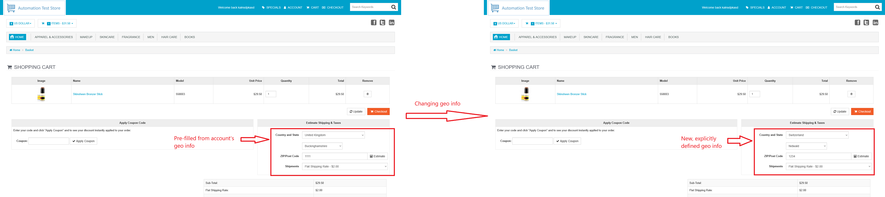
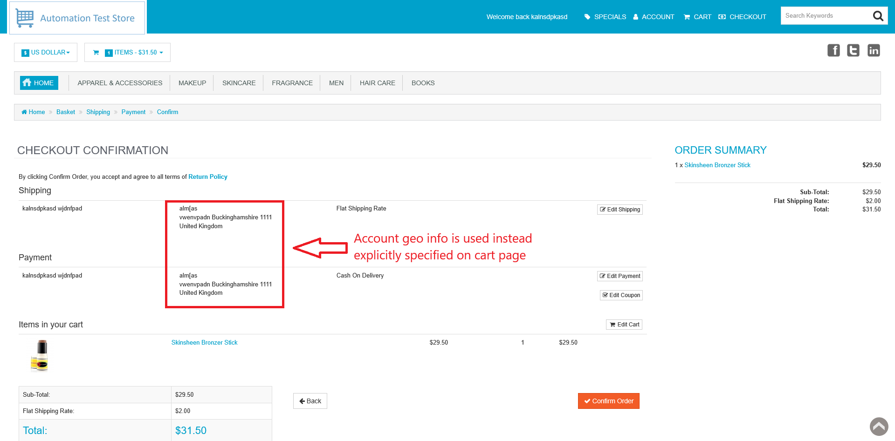
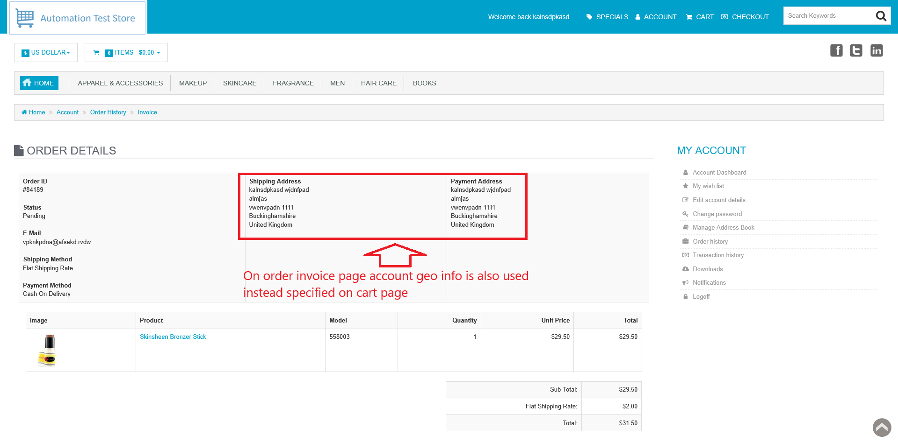

# ID: BR-CHK-03

## Summary

"Estimate Shipping & Taxes" cart page form is ignored

## Reproducibility: Always

## Severity: High

## Priority: High

## Workaround:

No

## Description

"Estimate Shipping & Taxes" cart page form is pre-filed with account's geographical info. If values of the inputs in the form are changed, account's geographical info is displayed on checkout page and order invoice page, not changed for this specific order info.

| Expected result                                                                                                                                | Actual result                                                                       |
|------------------------------------------------------------------------------------------------------------------------------------------------|-------------------------------------------------------------------------------------|
| Geographical info, explicitly specified in "Estimate Shipping & Taxes" cart page form, is used during final checkout and on order invoice page | Account's geographical info is used during final checkout and on order invoice page |

### Violated requirement: 

## Steps to reproduce:

Preconditions:
1. You are logged in;
2. Clear the cart, if it is not empty.

Steps:
1. Navigate to home page (https://automationteststore.com/);
2. Select any in-stock product, click on its icon to navigate to product page and add it to cart in valid quantity;
3. Change the values in "Estimate Shipping & Taxes" form to other valid values;
4. Click on "Checkout" button;
5. (To see geographical info mismatch) on checkout success page (/index.php?rt=checkout/success) click on *invoice page* link.

## Comments

\-

## Attachments

### Changing "Estimate Shipping & Taxes" cart page form values

### Checkout confirm page displays account's geographical info

### Account's geographical info is also used on order invoice page for this order

