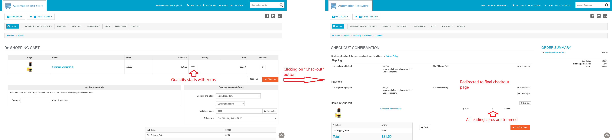

# ID: BR-CHK-04

## Summary

Cart page processes quantity, starting with zeros

## Reproducibility: Always

## Severity: High

## Priority: High

## Workaround:

No

## Description

If for cart page's quantity field for any product in the cart numeric value is specified, that starts with arbitrary number of zero characters (`0`), leading zero characters are trimmed and order checkout is continued with product in trimmed quantity.

| Expected result                                                                                                                               | Actual result                                                                                                                 |
|-----------------------------------------------------------------------------------------------------------------------------------------------|-------------------------------------------------------------------------------------------------------------------------------|
| Quantity of the product is set back to its previous value, and error message "Unacceptable quantity" is displayed above products in cart list | No error message is displayed. Redirected to final checkout page with product of trimmed quantity (leading zeros are trimmed) |

### Violated requirement: [DS-CHK-01.01](./../../../requirements/checkout-requirements.md#ds-chk-01-cart-management--validation)

## Steps to reproduce:

Preconditions:
1. You are logged in;
2. Clear the cart, if it is not empty.

Steps:
1. Navigate to home page (https://automationteststore.com/);
2. Select any in-stock product, click on its icon to navigate to product page and add it to cart in valid quantity;
3. On cart page, add arbitrary number of zero characters (`0`) at the beginning of product's quantity field;
4. Click on "Checkout" button.

## Comments

\-

## Attachments

