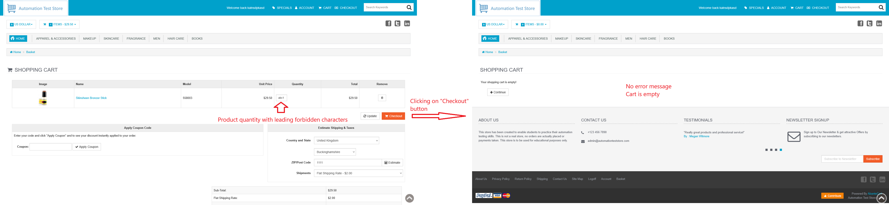
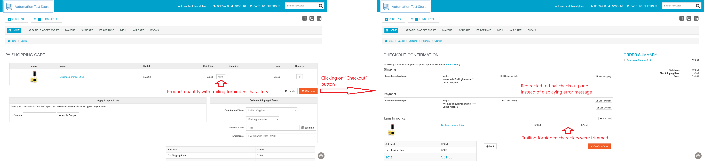

# ID: BR-CHK-05

## Summary

Incorrect behavior on forbidden characters in cart quantity

## Reproducibility: Always

## Severity: High

## Priority: High

## Workaround:

No

## Description

When value of product quantity on cart page contains not allowed characters, error message "Unacceptable quantity" is not displayed. Instead, depending on position of forbidden characters in quantity value, one of listed below happens:
1. if quantity value starts with forbidden character(s), product is deleted from cart entirely;
2. if forbidden character(s) are in the middle of at the end of the quantity field value, the value is trimmed from the beginning till first forbidden character. App redirects to final checkout page with product of trimmed quantity.

| Expected result                                                                                                                 | Actual result                                                                                                                                                                                                                                                                                                                                                            |
|---------------------------------------------------------------------------------------------------------------------------------|--------------------------------------------------------------------------------------------------------------------------------------------------------------------------------------------------------------------------------------------------------------------------------------------------------------------------------------------------------------------------|
| Quantity of the products is set to previous value and error message "Unacceptable quantity" is shown on "Checkout" button click | No error message is shown: - if quantity value starts with forbidden character(s), product is deleted from cart entirely; - if forbidden character(s) are in the middle of at the end of the quantity field value, the value is trimmed from the beginning till first forbidden character. App redirects to final checkout page with product of trimmed quantity |

### Violated requirement: [DS-CHK-01.01.01](./../../../requirements/checkout-requirements.md#ds-chk-01-cart-management--validation)

## Steps to reproduce:

Preconditions:
1. You are logged in;
2. Clear the cart, if it is not empty.

Steps (to reproduce leading forbidden characters behavior):
1. Navigate to home page (https://automationteststore.com/);
2. Select any in-stock product, click on its icon to navigate to product page and add it to cart in valid quantity;
3. On cart page, insert arbitrary number on characters, that are not listed as allowed, at the beginning of quantity field for added product;
4. Click on "Checkout" button.

Steps (to reproduce middle/trailing forbidden characters behavior):
1. Navigate to home page (https://automationteststore.com/);
2. Select any in-stock product, click on its icon to navigate to product page and add it to cart in valid quantity;
3. On cart page, insert arbitrary number on characters, that are not listed as allowed, in the middle or at the end of quantity field for added product;
4. Click on "Checkout" button.

## Comments

\-

## Attachments

### Leading forbidden characters

### Trailing (and at the middle of the quantity value) forbidden characters

