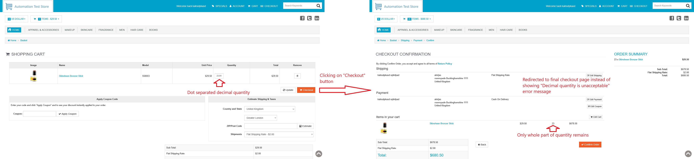

# ID: BR-CHK-06

## Summary

Incorrect behavior on decimal cart quantity

## Reproducibility: Always

## Severity: High

## Priority: High

## Workaround:

No

## Description

If for added to cart product quantity is set to decimal number (both comma and dot separated), error message "Decimal quantity is unacceptable" is not shown. Instead, quantity value is trimmed to whole part, and app proceeds to checkout with product of trimmed quantity.

| Expected result                                                                                                                                                                     | Actual result                                                                                                                         |
|-------------------------------------------------------------------------------------------------------------------------------------------------------------------------------------|---------------------------------------------------------------------------------------------------------------------------------------|
| Quantity of the product is set back to its previous value, and error message "Decimal quantity is unacceptable" is displayed above products in cart list on "Checkout" button click | No error message is shown. Quantity is trimmed to whole part of the number, app proceeds to checkout with product of trimmed quantity |

### Violated requirement: [DS-CHK-01.01.01](./../../../requirements/checkout-requirements.md#ds-chk-01-cart-management--validation)

## Steps to reproduce:

Preconditions:
1. You are logged in;
2. Clear the cart, if it is not empty.

Steps:
1. Navigate to home page (https://automationteststore.com/);
2. Select any in-stock product, click on its icon to navigate to product page and add it to cart in valid quantity;
3. On cart page, change quantity value of added product to decimal (comma or dot separated) number;
4. Click on "Checkout" button.

## Comments

\-

## Attachments

