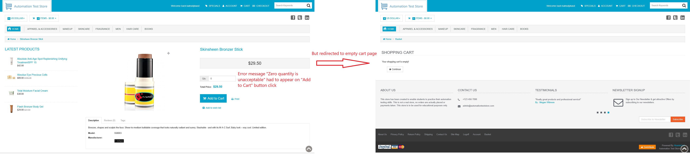
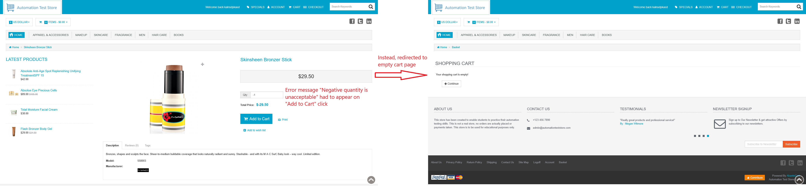
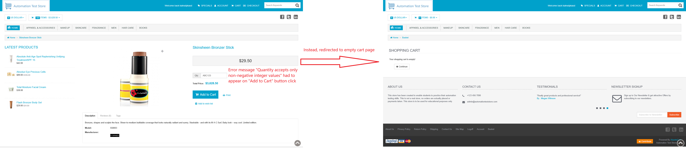
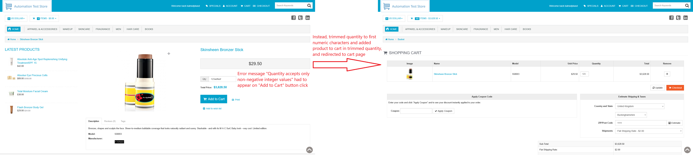

# ID: BR-CHK-01

## Summary

Redirect to cart page on incorrect quantity on product page

## Reproducibility: Always

## Severity: High

## Priority: High

## Workaround:

No

## Description

In cases of violation of listed below validation rules of quantity field on product page, appropriate error message is not displayed:
- if quantity is equal to zero;
- if quantity is decimal number;
- if quantity is negative number;
- if quantity value contains forbidden characters.

Instead, redirected to cart page.

| Expected result                                                                                                                                                                                                                                                                                                                                                                                                  | Actual result                                                                                                                                                                                                                                                                                                                                                                                                                                                                                                                                                                             |
|------------------------------------------------------------------------------------------------------------------------------------------------------------------------------------------------------------------------------------------------------------------------------------------------------------------------------------------------------------------------------------------------------------------|-------------------------------------------------------------------------------------------------------------------------------------------------------------------------------------------------------------------------------------------------------------------------------------------------------------------------------------------------------------------------------------------------------------------------------------------------------------------------------------------------------------------------------------------------------------------------------------------|
| Corresponding error message is displayed, depending of exact validation violation: 1. "Zero quantity is unacceptable" if quantity is equal to zero; 2. "Decimal quantity is unacceptable" if quality is decimal number; 3. "Negative quantity is unacceptable" if quality is negative number; 4. "Quantity accepts only non-negative integer values" if quantity contains not allowed characters | Redirects to cart page with result, depending on validation violation: - the cart is empty if quality has been equal to zero, negative number, or its first character was non-numeric; - the quantity is trimmed from first non-numeric character to the end of quantity value (`123abc456` -> `123`), and product is added to cart in trimmed quantity, if entered quantity has been decimal number (only whole part remains), or if quantity started with numeric character, but contained non-numeric characters (trimmed from first non-numeric to the end of quantity value) |

### Violated requirement: [DS-CHK-01.01, DS-CHK-01.02](./../../../requirements/checkout-requirements.md#ds-chk-01-cart-management--validation)

## Steps to reproduce:

Preconditions:
1. You are logged in;
2. Clear the cart, if it is not empty.

Steps:
1. Navigate to home page (https://automationteststore.com/);
2. Select any in-stock product and click on its icon to navigate to product page;
3. *Select corresponding desired scenario step from table below*;
4. Click on "Add To Cart" button.

Depending on what scenario you want to reproduce, select appropriate step #3 from table below:

| Reproduced scenario                                                                                                                 | Step #3                                                                                                               |
|-------------------------------------------------------------------------------------------------------------------------------------|-----------------------------------------------------------------------------------------------------------------------|
| Redirect to empty cart page with zero quantity                                                                                      | Clear "Qty" field and enter `0`                                                                                       |
| Redirect to empty cart page with negative number quantity                                                                           | Clear "Qty" field and enter negative number                                                                           |
| Redirect to empty cart page with quantity, that starts with non-numeric character                                                   | Clear "Qty" field and enter value, that starts with non-numeric characters                                            |
| Trimming quantity and adding product to cart with decimal quantity                                                                  | Clear "Qty" field and enter decimal (`.` or `,` separated) number                                                     |
| Trimming quantity and adding product to cart with quantity, that starts with numeric character, but contains non-numeric characters | Clear "Qty" field and enter value, that contains non-numeric characters, but starts from numeric ones (`123svs13d(+`) |

## Comments

\-

## Attachments

### Redirect to empty cart page with zero quantity

### Redirect to empty cart page with negative number quantity

### Redirect to empty cart page with quantity, that starts with non-numeric character

### Trimming quantity and adding product to cart with decimal quantity

### Trimming quantity and adding product to cart with quantity, that starts with numeric character, but contains non-numeric characters

