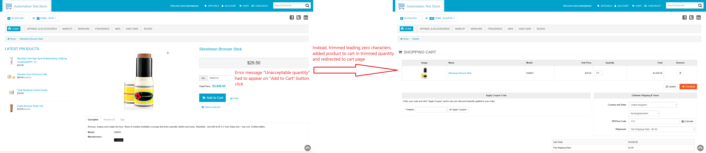

# ID: BR-CHK-02

## Summary

Product page processes quantity, starting with zeros

## Reproducibility: Always

## Severity: Medium

## Priority: Medium

## Workaround:

No

## Description

If for Product page's quantity field specified numeric value, that starts with arbitrary number of zero characters (`0`), leading zero characters are trimmed and product is added to cart in trimmed quantity.

| Expected result                                                                                         | Actual result                                                                                                                                                                                                                                                                                                                                                                                                       |
|---------------------------------------------------------------------------------------------------------|---------------------------------------------------------------------------------------------------------------------------------------------------------------------------------------------------------------------------------------------------------------------------------------------------------------------------------------------------------------------------------------------------------------------|
| Error message "Unacceptable quantity" is displayed next to quantity field on "Add to Cart" button click | No error message is displayed. Quantity value is trimmed to delete leading zero characters, and further validation proceeds with trimmed value. If trimmed quantity is valid value for product page's quantity field (see [DS-CHK-01.01](./../../../requirements/checkout-requirements.md#ds-chk-01-cart-management--validation)), then product is added to cart in trimmed quantity nad app redirects to cart page |

### Violated requirement: [DS-CHK-01.01](./../../../requirements/checkout-requirements.md#ds-chk-01-cart-management--validation)

## Steps to reproduce:

Preconditions:
1. You are logged in;
2. Clear the cart, if it is not empty.

Steps:
1. Navigate to home page (https://automationteststore.com/);
2. Select any in-stock product and click on its icon to navigate to product page;
3. Fill "Qty" field with valid value and add arbitrary number of zero characters `0` at its beginning;
4. Click on "Add To Cart" button.

## Comments

\-

## Attachments

