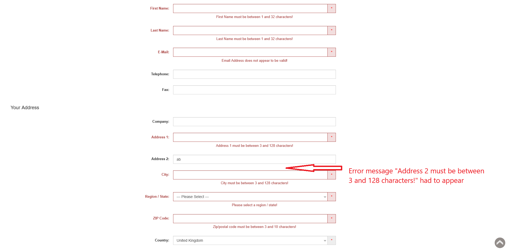
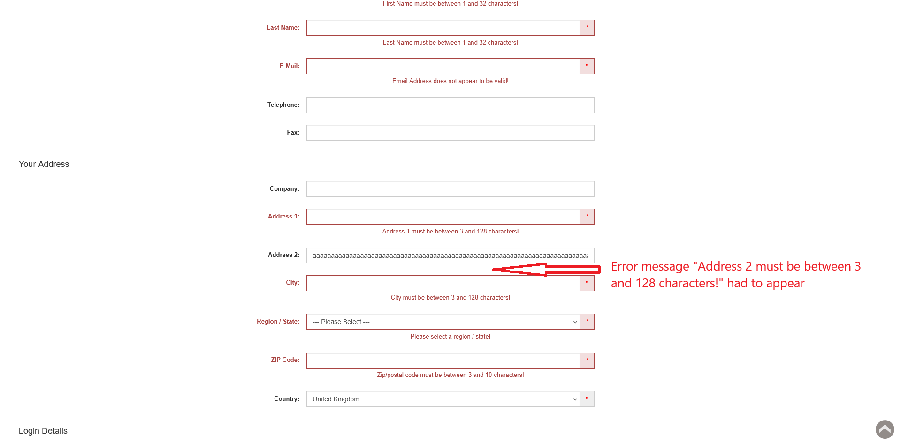

# ID: BR-REG-13

## Summary

Registration "Address 2" field does not have length validation

## Reproducibility: Always

## Severity: Low

## Priority: Low

## Workaround:

No

## Description

"Address 2" field on registration form accepts values, which length greater than upper boundary / smaller than lower boundary, as valid address.

| Expected result                                                                                                                   | Actual result                                                                                                           |
|-----------------------------------------------------------------------------------------------------------------------------------|-------------------------------------------------------------------------------------------------------------------------|
| Error message "Address 2 must be between 3 and 128 characters!" is displayed next to "Address 2" field on "Continue" button click | No message showed. If all necessary fields are filled with valid values, registration is successful, account is created |

### Violated requirement: [DS-REG-08.01](./../../../requirements/registration-requirements.md#ds-reg-08-address-2)

## Steps to reproduce:

Preconditions:
1. You are logged out.

Steps (to reproduce absence of length lower boundary):
1. Navigate to registration page (https://automationteststore.com/index.php?rt=account/create);
2. Fill "Address 2" field with valid value, which length is smaller than lower boundary for length of the field;
3. Click on "Continue" button.

Steps (to reproduce absence of length upper boundary):
1. Navigate to registration page (https://automationteststore.com/index.php?rt=account/create);
2. Fill "Address 2" field with valid value, which length is greater than upper boundary for length of the field;
3. Click on "Continue" button.

## Comments

\-

## Attachments

### Too short "Address 2" value

### Too long "Address 2" value

