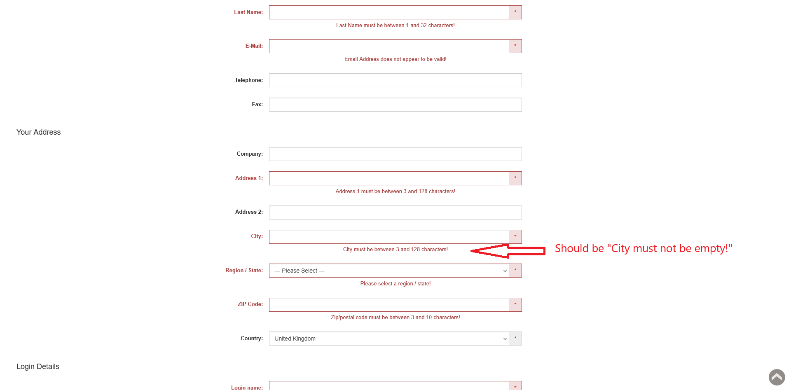

# ID: BR-REG-14

## Summary

Incorrect error message on empty "City" field during registration

## Reproducibility: Always

## Severity: Low

## Priority: Low

## Workaround:

No

## Description

If registration form has been submitted with empty "City" field, returned error message says "City 1 must be between 3 and 128 characters!".

| Expected result                                                                                      | Actual result                                                                                |
|------------------------------------------------------------------------------------------------------|----------------------------------------------------------------------------------------------|
| Error message "City must not be empty!" is displayed next to "City" field on "Continue" button click | Error message "City must be between 3 and 128 characters!" is displayed next to "City" field |

### Violated requirement: [DS-REG-09.01](./../../../requirements/registration-requirements.md#ds-reg-09-city)

## Steps to reproduce:

Preconditions:
1. You are logged out.

Steps:
1. Navigate to registration page (https://automationteststore.com/index.php?rt=account/create);
2. Do not fill "City" field and click on "Continue" button (state of other fields does not matter);

## Comments

\-

## Attachments

