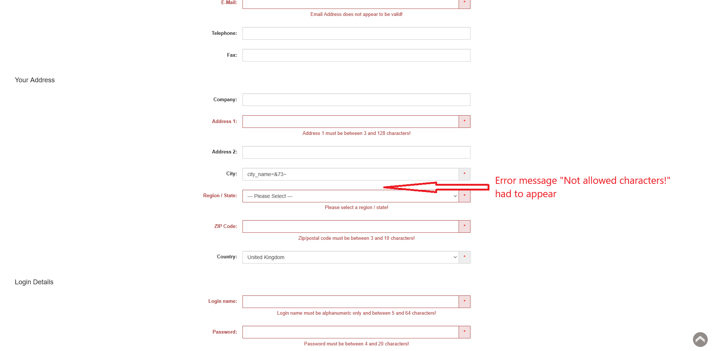

# ID: BR-REG-15

## Summary

Registration "City" field accepts forbidden characters

## Reproducibility: Always

## Severity: High

## Priority: High

## Workaround:

No

## Description

"City" field on registration page accepts values, that contain forbidden characters, as valid city name: no error message displayed and further registration is not prevented. If all other necessary fields are filled with valid values, registration will be successful.

| Expected result                                                                                      | Actual result                                                                                                                          |
|------------------------------------------------------------------------------------------------------|----------------------------------------------------------------------------------------------------------------------------------------|
| Error message "Not allowed characters!" is displayed next to "City" field on "Continue" button click | No error message displayed. If all other necessary fields are filled with valid values, registration is successful, account is created |

### Violated requirement: [DS-REG-09.03](./../../../requirements/registration-requirements.md#ds-reg-09-city)

## Steps to reproduce:

Preconditions:
1. You are logged out.

Steps:
1. Navigate to registration page (https://automationteststore.com/index.php?rt=account/create);
2. Fill "City" field with value of valid length, that contain characters, that are not listed as allowed for the field;
3. Click on "Continue" button.

## Comments

\-

## Attachments

