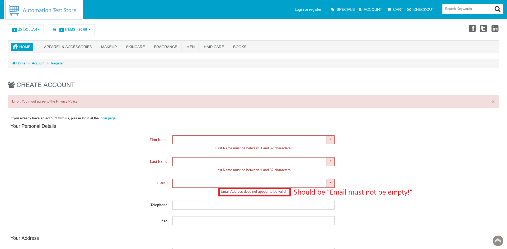

# ID: BR-REG-09

## Summary

Incorrect error message on empty "Email" field during registration

## Reproducibility: Always

## Severity: Low

## Priority: Low

## Workaround:

No

## Description

If registration form has been submitted with empty "Email" field, returned error message says "Email Address does not appear to be valid!".

| Expected result                                                                                        | Actual result                                                                                 |
|--------------------------------------------------------------------------------------------------------|-----------------------------------------------------------------------------------------------|
| Error message "Email must not be empty!" is displayed next to "Email" field on "Continue" button click | Error message "Email Address does not appear to be valid!" is displayed next to "Email" field |

### Violated requirement: [DS-REG-03.01](./../../../requirements/registration-requirements.md#ds-reg-03-e-mail)

## Steps to reproduce:

Preconditions:
1. You are logged out

Steps:
1. Navigate to registration page (https://automationteststore.com/index.php?rt=account/create);
2. Do not fill "Email" field and click on "Continue" button (state of other fields does not matter).

## Comments

\-

## Attachments

