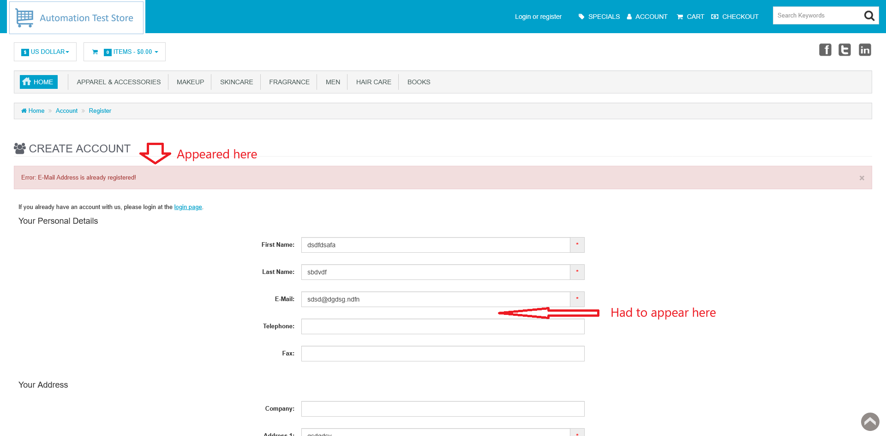

# ID: BR-REG-10

## Summary

"Already used email" message appeared in wrong place on registration page

## Reproducibility: Always

## Severity: Low

## Priority: Low

## Workaround:

No

## Description

After attempt to register new account with already used email, error message appeared at the top of registration form as general error, not next to "Email" field.

| Expected result                                                                                                     | Actual result                                                                                                                                               |
|---------------------------------------------------------------------------------------------------------------------|-------------------------------------------------------------------------------------------------------------------------------------------------------------|
| Error message "E-Mail Address is already registered!" is displayed next to "Email" field on "Continue" button click | Error message "E-Mail Address is already registered!" is displayed at the top of registration form as general registration error on "Continue" button click |

### Violated requirement: [DS-REG-03.02](./../../../requirements/registration-requirements.md#ds-reg-03-e-mail)

## Steps to reproduce:

Preconditions:
1. You are logged out;
2. There is no registered account on email and login name, that will be used for first successful registration.

Steps:
1. Navigate to registration page (https://automationteststore.com/index.php?rt=account/create);
2. Fill all necessary fields with valid values (save used email for later);
3. Click on "Continue" button;
4. Hover cursor over "Welcome back *login name*" in header section;
5. Click on "Not *login name*? Logoff" option in appeared menu;
6. Navigate to registration page (https://automationteststore.com/index.php?rt=account/create);
7. Fill all necessary fields with valid values. Use saved on step #2 email;
8. Click on "Continue" button.

To shorten number of steps, you can take email of any already registered account and start from step #6.

## Comments

\-

## Attachments

