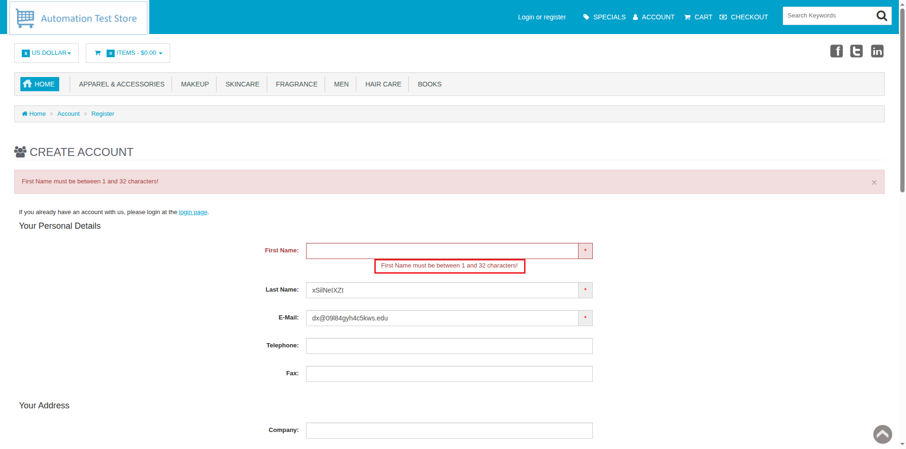

# ID: BR-REG-01

## Summary

Incorrect error message on empty "First Name" field on registration page

## Reproducibility: Always

## Severity: Low

## Priority: Low

## Workaround:

No

## Description

If registration form has been submitted with empty "First Name" field, returned error message says "First Name must be between 1 and 32 characters!".

| Expected result                                                                                                  | Actual result                                                                                           |
|------------------------------------------------------------------------------------------------------------------|---------------------------------------------------------------------------------------------------------|
| Error message "First Name must not be empty!" is displayed next to "First Name" field on "Continue" button click | Error message "First Name must be between 1 and 32 characters!" is displayed next to "First Name" field |

### Violated requirement: [DS-REG-01.01](./../../../requirements/registration-requirements.md#ds-reg-01-first-name)

## Steps to reproduce:

Preconditions:
1. You are logged out.

Steps:
1. Navigate to registration page (https://automationteststore.com/index.php?rt=account/create);
2. Do not fill "First Name" field and click on "Continue" button (state of other fields does not matter);

## Comments

\-

## Attachments

