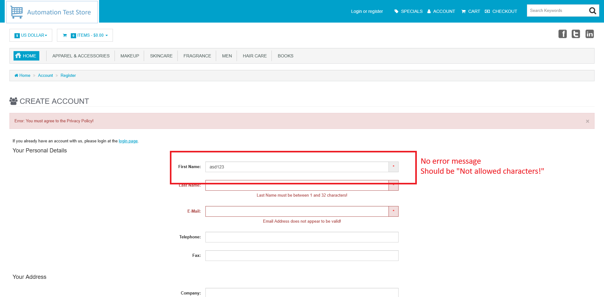

# ID: BR-REG-02

## Summary

"First Name" field accepts numeric symbols during registration

## Reproducibility: Always

## Severity: High

## Priority: High

## Workaround:

No

## Description

"First Name" field accepts value with numeric symbols as valid name, does not show error message and does not prevent from further registration process, which, if all other necessary fields are filled with valid values, leads to successful registration on submitting the form.

| Expected result                                                                                            | Actual result                                                                                                                 |
|------------------------------------------------------------------------------------------------------------|-------------------------------------------------------------------------------------------------------------------------------|
| Error message "Not allowed characters!" is displayed next to "First Name" field on "Continue" button click | No message showed. If all other necessary fields are filled with valid values, registration is successful, account is created |

### Violated requirement: [DS-REG-01-03](./../../../requirements/registration-requirements.md#ds-reg-01-first-name)

## Steps to reproduce:

Preconditions:
1. You are logged out

Steps (to reproduce absence of error message):
1. Navigate to registration page (https://automationteststore.com/index.php?rt=account/create);
2. Fill "First Name" field with value of valid length, that contains numbers, and click on "Continue" button (leave all other fields empty);

Steps (to reproduce successful registration):
1. Navigate to registration page (https://automationteststore.com/index.php?rt=account/create);
2. Fill "First Name" field with value of valid length, that contains numbers;
3. Fill all other necessary fields with valid values and click on "Continue" button;

## Comments

\-

## Attachments

No error message
