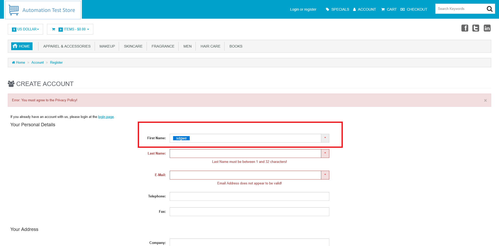

# ID: BR-REG-03

## Summary

"First Name" does not trim whitespaces during registration

## Reproducibility: Always

## Severity: High

## Priority: High

## Workaround:

No

## Description

"First Name" field does not trim leading and trailing whitespace characters and accepts solely whitespaces as valid name. In case of valid values for all others necessary fields, registration will be successful.

| Expected result                                                                                                                           | Actual result                                                                                                                                 |
|-------------------------------------------------------------------------------------------------------------------------------------------|-----------------------------------------------------------------------------------------------------------------------------------------------|
| Space characters are trimmed, error message "First Name must not be empty!" appears next to "First Name" field on "Continue" button click | Space characters are not trimmed.  If all other necessary fields are filled with valid values, registration is successful, account is created |

### Violated requirement: [DS-REG-01-03-01](./../../../requirements/registration-requirements.md#ds-reg-01-first-name)

## Steps to reproduce:

Preconditions:
1. You are logged out

Steps (to reproduce absence of error message):
1. Navigate to registration page (https://automationteststore.com/index.php?rt=account/create);
2. Fill "First Name" field with value of valid length, that contains only whitespaces, and click on "Continue" button (leave all other fields empty);

Steps (to reproduce successful registration):
1. Navigate to registration page (https://automationteststore.com/index.php?rt=account/create);
2. Fill "First Name" field with value of valid length, that contains only whitespaces, or that contains leading and trailing whitespaces;
3. Fill all other necessary fields with valid values and click on "Continue" button;

## Comments

\-

## Attachments

Not trimmed `space` characters
