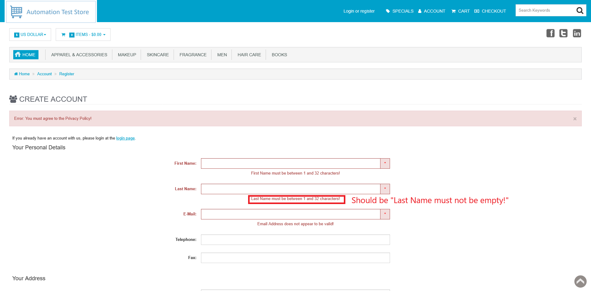

# ID: BR-REG-05

## Summary

Incorrect error message on empty "Last Name" field on registration page

## Reproducibility: Always

## Severity: Low

## Priority: Low

## Workaround:

No

## Description

If registration form has been submitted with empty "Last Name" field, returned error message says "Last Name must be between 1 and 32 characters!".

| Expected result                                                                                                | Actual result                                                                                         |
|----------------------------------------------------------------------------------------------------------------|-------------------------------------------------------------------------------------------------------|
| Error message "Last Name must not be empty!" is displayed next to "Last Name" field on "Continue" button click | Error message "Last Name must be between 1 and 32 characters!" is displayed next to "Last Name" field |

### Violated requirement: [DS-REG-02.01](./../../../requirements/registration-requirements.md#ds-reg-02-last-name)

## Steps to reproduce:

Preconditions:
1. You are logged out.

Steps:
1. Navigate to registration page (https://automationteststore.com/index.php?rt=account/create);
2. Do not fill "Last Name" field and click on "Continue" button (state of other fields does not matter);

## Comments

\-

## Attachments

