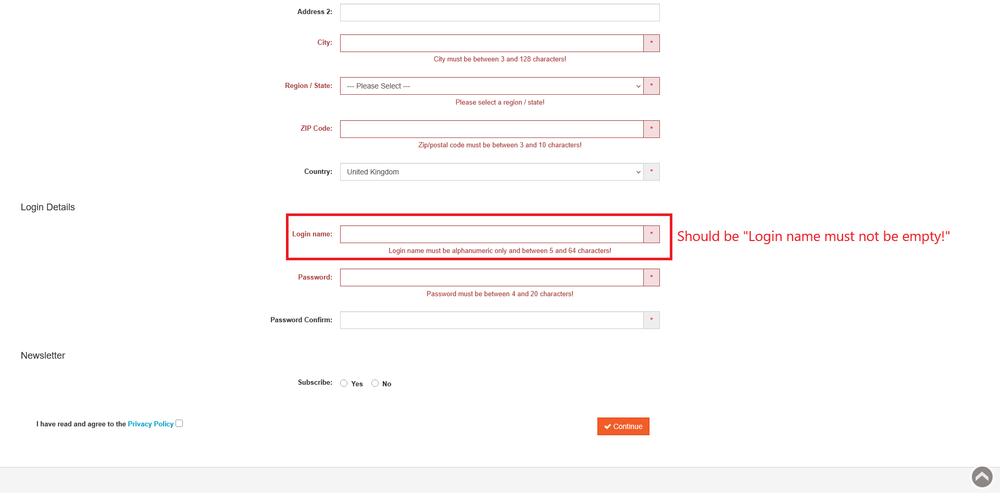

# ID: BR-REG-19

## Summary

Incorrect error message on empty "Login Name" field during registration

## Reproducibility: Always

## Severity: Low

## Priority: Low

## Workaround:

No

## Description

If registration form has been submitted with empty "Login name" field, returned error message says "Login name must be alphanumeric only and between 5 and 64 characters!".

| Expected result                                                                                                  | Actual result                                                                                                                 |
|------------------------------------------------------------------------------------------------------------------|-------------------------------------------------------------------------------------------------------------------------------|
| Error message "Login name must not be empty!" is displayed next to "Login name" field on "Continue" button click | Error message "Login name must be alphanumeric only and between 5 and 64 characters!" is displayed next to "Login name" field |

### Violated requirement: [DS-REG-13.01](./../../../requirements/registration-requirements.md#ds-reg-13-login-name)

## Steps to reproduce:

Preconditions:
1. You are logged out.

Steps:
1. Navigate to registration page (https://automationteststore.com/index.php?rt=account/create);
2. Do not fill "Login name" field and click on "Continue" button (state of other fields does not matter);

## Comments

\-

## Attachments

