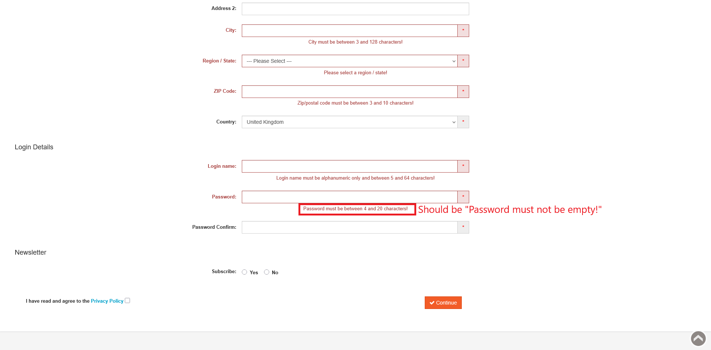

# ID: BR-REG-20

## Summary

Incorrect error message on empty "Password" field during registration

## Reproducibility: Always

## Severity: Low

## Priority: Low

## Workaround:

No

## Description

If registration form has been submitted with empty "Password" field, returned error message says "Password must be between 4 and 20 characters!".

| Expected result                                                                                              | Actual result                                                                                       |
|--------------------------------------------------------------------------------------------------------------|-----------------------------------------------------------------------------------------------------|
| Error message "Password must not be empty!" is displayed next to "Password" field on "Continue" button click | Error message "Password must be between 4 and 20 characters!" is displayed next to "Password" field |

### Violated requirement: [DS-REG-14.01](./../../../requirements/registration-requirements.md#ds-reg-14-password)

## Steps to reproduce:

Preconditions:
1. You are logged out.

Steps:
1. Navigate to registration page (https://automationteststore.com/index.php?rt=account/create);
2. Do not fill "Password" field and click on "Continue" button (state of other fields does not matter);

## Comments

\-

## Attachments

