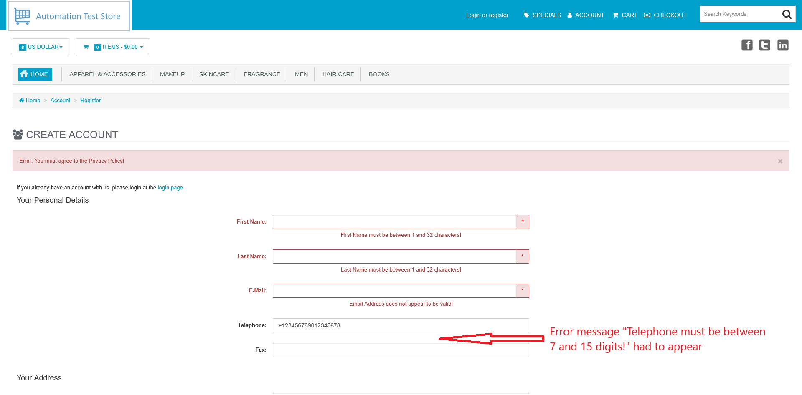
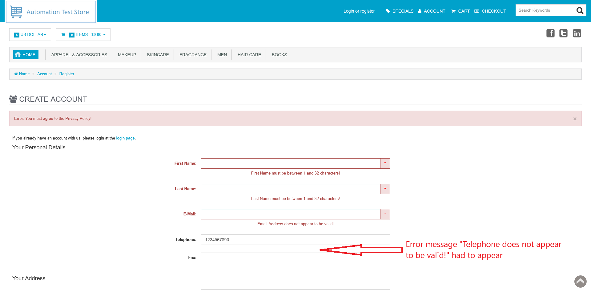

# ID: BR-REG-11

## Summary

Registration "Telephone" field does not have any validation

## Reproducibility: Always

## Severity: High

## Priority: High

## Workaround:

No

## Description

"Telephone" field on registration page does not have any form of validation, which are:
1. No upper and lower length boundaries;
2. No validation on position of `+` sign and its presence;
3. No validation on entered characters (accepts any symbols, not only numeric).

In case of violation of these validation rules, no error message is shown and provided value is considered as valid phone number, which, if all necessary fields are filled with valid values, leads to successful registration.

| Expected result                                                                                                                                                                                                                                                                       | Actual result                                                                                                                    |
|---------------------------------------------------------------------------------------------------------------------------------------------------------------------------------------------------------------------------------------------------------------------------------------|----------------------------------------------------------------------------------------------------------------------------------|
| Depending on violated validation rule, one of these error messages is shown: 1. "Telephone must be between 7 and 15 digits!" in case of length validation violation; 2. "Telephone does not appear to be valid!" in other situations of validation violation described higher | No error message is shown.  If all necessary fields are filled with valid values, registration is successful, account is created |

### Violated requirement: [DS-REG-04-01, DS-REG-04-02](./../../../requirements/registration-requirements.md#ds-reg-04-telephone)

## Steps to reproduce:

Preconditions:
1. You are logged out

Steps (to reproduce absence of length lover bound):
1. Navigate to registration page (https://automationteststore.com/index.php?rt=account/create);
2. Fill "Telephone" field with numeric value, that starts with `+` sign and consist less than minimal number of digits allowed;
3. Click on "Continue" button (state of other fields does not matter).

Steps (to reproduce absence of length upper bound):
1. Navigate to registration page (https://automationteststore.com/index.php?rt=account/create);
2. Fill "Telephone" field with numeric value, that starts with `+` sign and consist more than maximum number of digits allowed;
3. Click on "Continue" button (state of other fields does not matter).

Steps (to reproduce absence of `+` sign validation):
1. Navigate to registration page (https://automationteststore.com/index.php?rt=account/create);
2. Fill "Telephone" field with numeric value, that consist valid number of digits, but does not consist `+` sign;
3. Click on "Continue" button (state of other fields does not matter).

Steps (to reproduce absence of `+` sign validation):
1. Navigate to registration page (https://automationteststore.com/index.php?rt=account/create);
2. Fill "Telephone" field with numeric value, that consist valid number of digits and `+` sign in any position, except being the first character;
3. Click on "Continue" button (state of other fields does not matter).

Steps (to reproduce absence of accepted characters validation):
1. Navigate to registration page (https://automationteststore.com/index.php?rt=account/create);
2. Fill "Telephone" field with alphanumeric value of proper length;
3. Click on "Continue" button (state of other fields does not matter).

## Comments

\-

## Attachments

