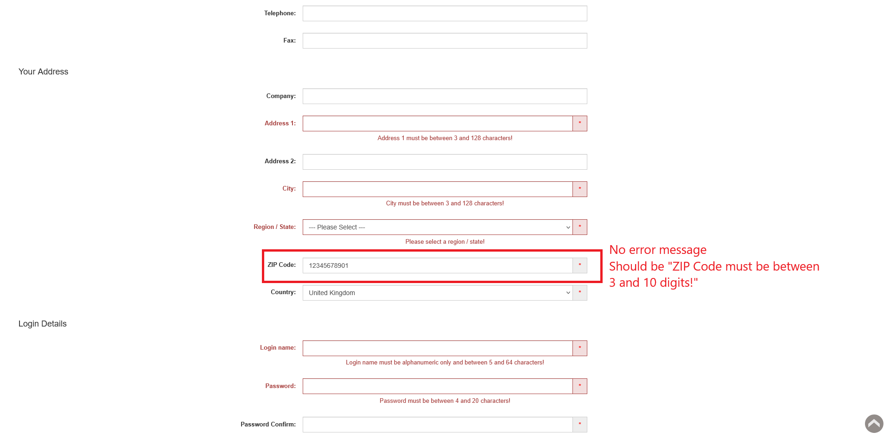

# ID: BR-REG-17

## Summary

Registration "ZIP Code" field does not have length upper bound validation

## Reproducibility: Always

## Severity: High

## Priority: High

## Workaround:

No

## Description

"ZIP Code" registration field accepts longer than permitted values as valid zip codes, does not show corresponding error message and does not prevent from further registration, which, in case of all other filled with valid values necessary fields, leads to successful registration.

| Expected result                                                                                                          | Actual result                                                                                                                             |
|--------------------------------------------------------------------------------------------------------------------------|-------------------------------------------------------------------------------------------------------------------------------------------|
| "ZIP Code must be between 3 and 10 digits!" error message is displayed below "ZIP Code" field on "Continue" button click | No error message is displayed. If all other necessary fields are filled with valid values, registration is successful, account is created |

### Violated requirement: [DS-REG-10.02](./../../../requirements/registration-requirements.md#ds-reg-10-zip-code)

## Steps to reproduce:

Preconditions:
1. You are logged out.

Steps:
1. Navigate to registration page (https://automationteststore.com/index.php?rt=account/create);
2. Fill "ZIP Code" field with valid value of length, that exceeds upper length bound;
3. Click on "Continue" button (state of other fields does not matter)

## Comments

\-

## Attachments

