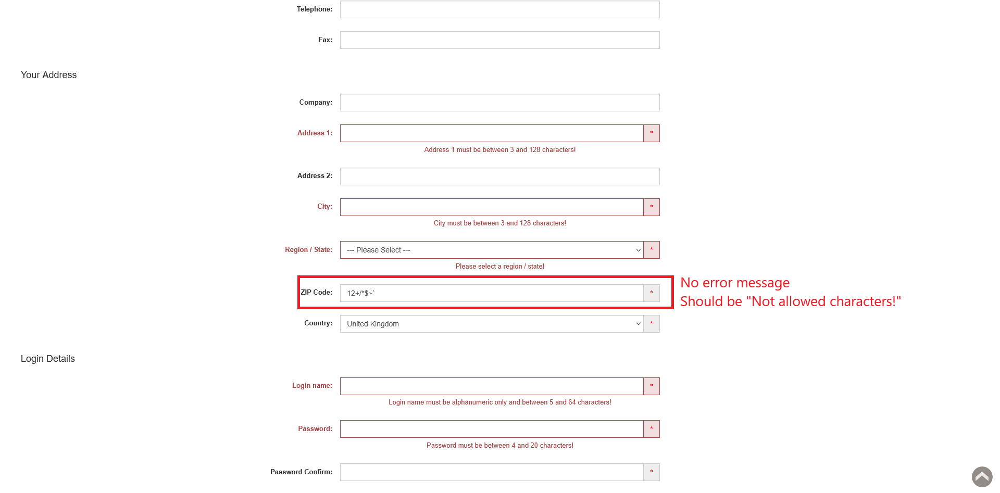

# ID: BR-REG-18

## Summary

Registration "ZIP Code" field accepts forbidden characters

## Reproducibility: Always

## Severity: High

## Priority: High

## Workaround:

No

## Description

"ZIP Code" field accepts values, that contain not allowed characters, as valid zip codes, does not show error message and does not prevent from registration, which leads to successful registration if all other necessary fields are filled with valid values.

| Expected result                                                                                          | Actual result                                                                                                                             |
|----------------------------------------------------------------------------------------------------------|-------------------------------------------------------------------------------------------------------------------------------------------|
| "Not allowed characters!" error message is displayed next to "ZIP Code" field on "Continue" button click | No error message is displayed. If all other necessary fields are filled with valid values, registration is successful, account is created |

### Violated requirement: [DS-REG-10.03](./../../../requirements/registration-requirements.md#ds-reg-10-zip-code)

## Steps to reproduce:

Preconditions:
1. You are logged out.

Steps:
1. Navigate to registration page (https://automationteststore.com/index.php?rt=account/create);
2. Fill "ZIP Code" field with value of valid length, that contains characters, that are not listed as allowed;
3. Click on "Continue" button (state of other fields does not matter)

## Comments

\-

## Attachments

