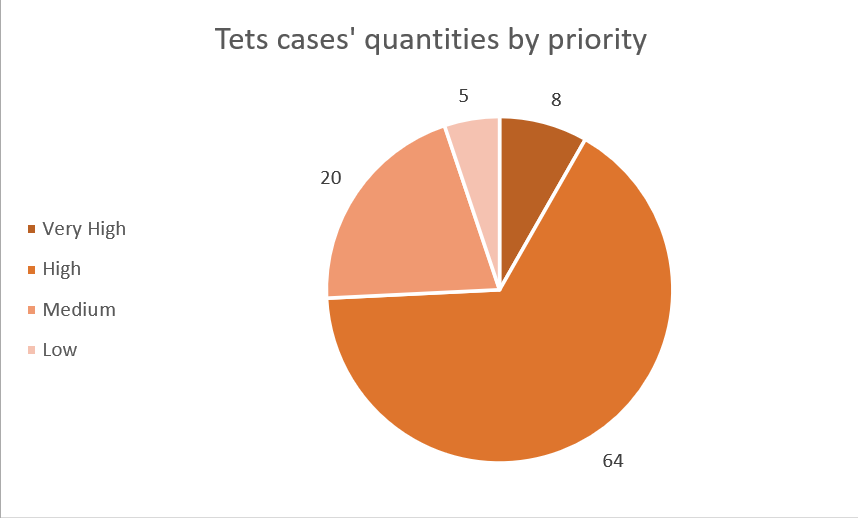
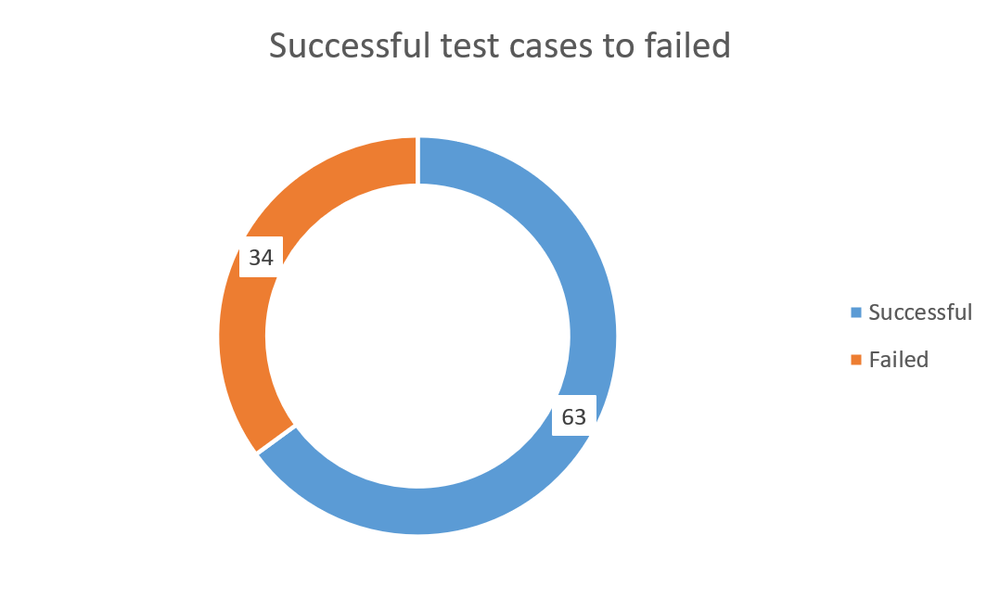
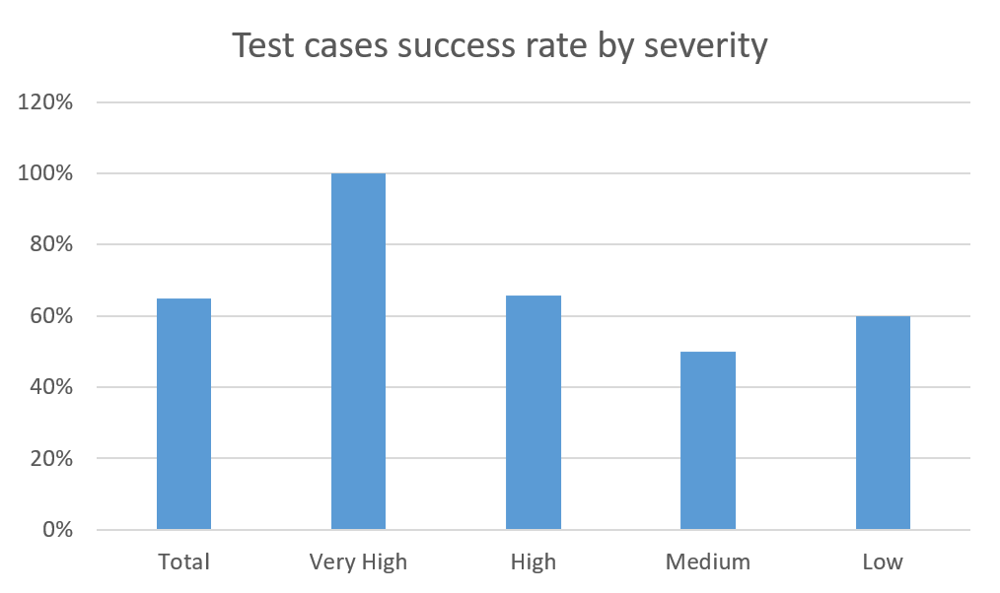
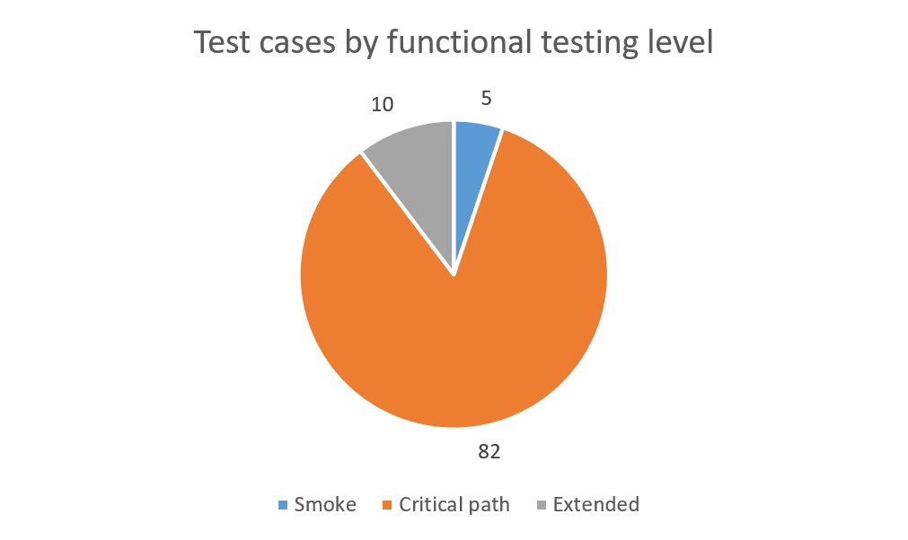
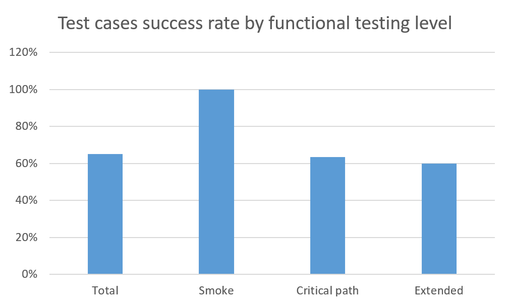
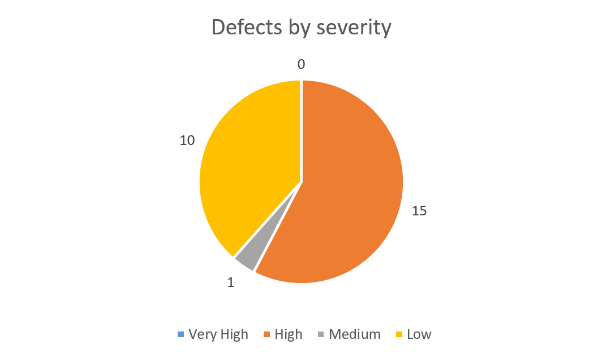
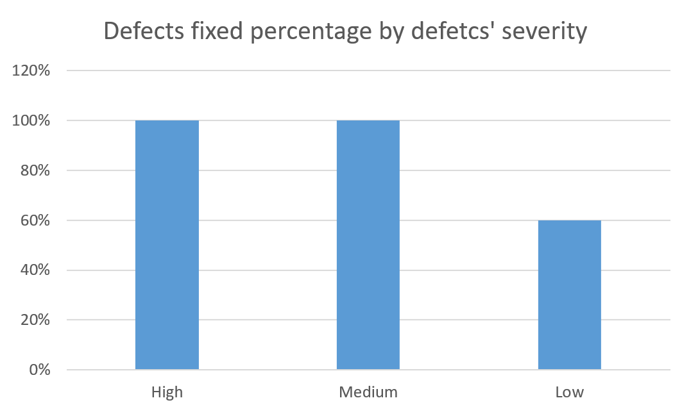
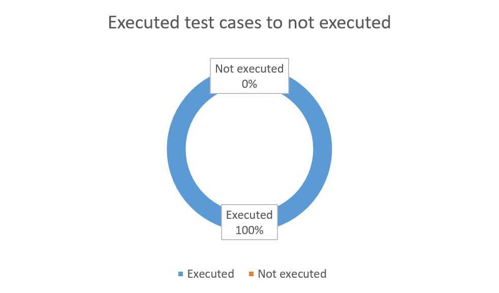

# Automation Test Store Test Results Report

## Summary

During testing period (01.05.27-30.07.27) no new builds were released. Latest (current) build successfully passed 100% Smoke tests and 66% of Critical Path tests. Critical Path test cases' success rate is [lower than acceptance criteria](./test-plan.md#acceptance-criteria), most part of defects clustered in fields validation and warnings messages on incorrect user messages. Parts of the application, excluded from current iteration test plan, are planned for next iteration.

## Test team

| Name              | Position | Role                                                        |
|-------------------|----------|-------------------------------------------------------------|
| Viktor Khrystenko | Tester   | Documentation creation, test cases execution, bug reporting |

## Testing process description

The only build during this testing period (current build) was tested under Windows 11 25H2. All Smoke, Critical Path and Extended test cases were executed using TA framework (Java 21, Selenium, TestNG, Allure Reports). Retesting of failed tests was performed manually on Firefox 147.0.3.

Due to illness of the only member of test team, all testing activities had to be postponed for two months. In all other aspects, testing process goes as intended.

### Metrics

[Test cases' success rate](./test-plan.md#test-cases-success-rate): 63/97, 65%

[Test cases' success rate](./test-plan.md#test-cases-success-rate) by priority:

| Very High | High | Medium | Low |
|:---------:|:----:|:------:|:---:|
|   100%    | 66%  |  50%   | 60% |

[Test cases' success rate](./test-plan.md#test-cases-success-rate) by functional testing level:

| Smoke  | Critical Path  | Extended  |
|:------:|:--------------:|:---------:|
|  100%  |      63%       |    60%    |

[Defects fixed percentage](./test-plan.md#defects-fixed-percentage) by severity:

| Very High | High | Medium | Low |
|:---------:|:----:|:------:|:---:|
|     -     | 100% |  100%  | 60% |

[Test cases execution percentage](./test-plan.md#test-cases-execution-percentage): 97/97, 100%

[Requirements coverage percentage](./test-plan.md#requirements-coverage-percentage): 98/110, 89%

## Timetable

| Name              | Date       | Activity                                | Duration, hours |
|-------------------|------------|-----------------------------------------|-----------------|
| Viktor Khrystenko | 01.05.2026 | Requirements refinement                 | 6               |
| Viktor Khrystenko | 02.05.2026 | Test cases creation                     | 4               |
| Viktor Khrystenko | 03.05.2026 | Test cases creation                     | 5               |
| Viktor Khrystenko | 03.05.2026 | Requirements refinement                 | 1               |
| Viktor Khrystenko | 23.07.2026 | Test cases creation                     | 5               |
| Viktor Khrystenko | 23.07.2026 | Test cases creation                     | 6               |
| Viktor Khrystenko | 24.07.2026 | Test automation framework work          | 1               |
| Viktor Khrystenko | 24.07.2026 | Manual retest of failed automated tests | 2               |
| Viktor Khrystenko | 24.07.2026 | Defect reporting                        | 4               |
| Viktor Khrystenko | 27.07.2026 | Manual retest of failed automated tests | 2               |
| Viktor Khrystenko | 27.07.2026 | Defect reporting                        | 5               |
| Viktor Khrystenko | 28.07.2026 | Manual retest of failed automated tests | 1               |
| Viktor Khrystenko | 28.07.2026 | Defect reporting                        | 3               |
| Viktor Khrystenko | 29.07.2026 | Manual retest of failed automated tests | 1               |
| Viktor Khrystenko | 29.07.2026 | Defect reporting                        | 4               |
| Viktor Khrystenko | 30.07.2026 | Test result reporting                   | 4               |

## Defects statistics by severity

| Status    | Quantity | Low | Medium | High | Very High |
|:----------|:--------:|:---:|:------:|:----:|:---------:|
| Submitted |    26    | 10  |   1    |  15  |     0     |
| Fixed     |    20    |  4  |   1    |  15  |     0     |
| Verified  |    17    |  3  |   1    |  13  |     0     |
| Reopened  |    2     |  1  |   0    |  1   |     0     |
| Declined  |    0     |  0  |   0    |  0   |     0     |

## Defects list

| ID                                                           | Severity | Summary                                                                   |
|--------------------------------------------------------------|----------|---------------------------------------------------------------------------|
| [BR-REG-01](./bug-reports/registration/first-name/BR-REG-01) | Low      | Incorrect error message on empty "First Name" field on registration page  |
| [BR-REG-02](./bug-reports/registration/first-name/BR-REG-02) | High     | "First Name" field accepts numeric symbols during registration            |
| [BR-REG-03](./bug-reports/registration/first-name/BR-REG-03) | High     | "First Name" does not trim whitespaces during registration                | 
| [BR-REG-04](./bug-reports/registration/first-name/BR-REG-04) | High     | "First Name" accepts special characters during registration               |
| [BR-REG-05](./bug-reports/registration/last-name/BR-REG-05)  | Low      | Incorrect error message on empty "Last Name" field on registration page   |
| [BR-REG-06](./bug-reports/registration/last-name/BR-REG-06)  | High     | "Last Name" field accepts numeric symbols during registration             |
| [BR-REG-07](./bug-reports/registration/last-name/BR-REG-07)  | High     | "Last Name" does not trim whitespaces during registration                 |
| [BR-REG-08](./bug-reports/registration/last-name/BR-REG-08)  | High     | "Last Name" accepts special characters during registration                |
| [BR-REG-09](./bug-reports/registration/email/BR-REG-09)      | Low      | Incorrect error message on empty "Email" field during registration        |
| [BR-REG-10](./bug-reports/registration/email/BR-REG-10)      | Low      | "Already used email" message appeared in wrong place on registration page |
| [BR-REG-11](./bug-reports/registration/telephone/BR-REG-11)  | High     | Registration "Telephone" field does not have any validation               |
| [BR-REG-12](./bug-reports/registration/address-1/BR-REG-12)  | Low      | Incorrect message on empty "Address 1" field during registration          |
| [BR-REG-13](./bug-reports/registration/address-2/BR-REG-13)  | Low      | Registration "Address 2" field does not have length validation            |
| [BR-REG-14](./bug-reports/registration/city/BR-REG-14)       | Low      | Incorrect error message on empty "City" field during registration         |
| [BR-REG-15](./bug-reports/registration/city/BR-REG-15)       | High     | Registration "City" field accepts forbidden characters                    |
| [BR-REG-16](./bug-reports/registration/zip-code/BR-REG-16)   | Low      | Incorrect error message on empty "ZIP Code" field during registration     |
| [BR-REG-17](./bug-reports/registration/zip-code/BR-REG-17)   | High     | Registration "ZIP Code" field does not have length upper bound validation |
| [BR-REG-18](./bug-reports/registration/zip-code/BR-REG-18)   | High     | Registration "ZIP Code" field accepts forbidden characters                |
| [BR-REG-19](./bug-reports/registration/login-name/BR-REG-19) | Low      | Incorrect error message on empty "Login Name" field during registration   |
| [BR-REG-20](./bug-reports/registration/password/BR-REG-20)   | Low      | Incorrect error message on empty "Password" field during registration     |
| [BR-CHK-01](./bug-reports/checkout/product-page/BR-CHK-01)   | High     | Redirect to cart page on incorrect quantity on product page               |
| [BR-CHK-02](./bug-reports/checkout/product-page/BR-CHK-02)   | Medium   | Product page processes quantity, starting with zeros                      |
| [BR-CHK-03](./bug-reports/checkout/cart/BR-CHK-03)           | High     | "Estimate Shipping & Taxes" cart page form is ignored                     |
| [BR-CHK-04](./bug-reports/checkout/cart/BR-CHK-04)           | High     | Cart page processes quantity, starting with zeros                         |
| [BR-CHK-05](./bug-reports/checkout/cart/BR-CHK-05)           | High     | Incorrect behavior on forbidden characters in cart quantity               |
| [BR-CHK-06](./bug-reports/checkout/cart/BR-CHK-06)           | High     | Incorrect behavior on decimal cart quantity                               |

## Recommendations

It is recommended to get at least one more test team member.

## Attachments

### Test cases by priority

### Successful test cases to failed

### Test cases' success rate by severity 

### Test cases by functional testing level

### Test cases' success rate by functional testing level

### Defects by severity

### Defects fixed percentage by defects' severity

### Executed test cases to not executed

